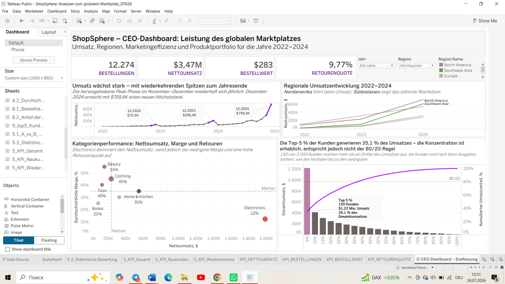
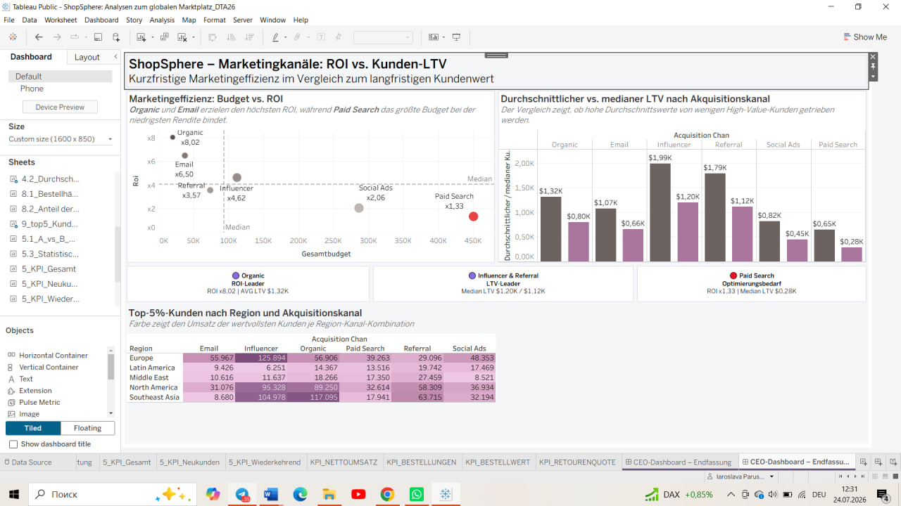
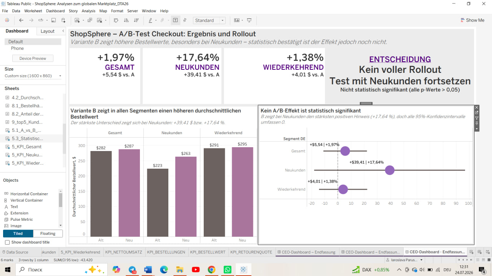

# ShopSphere — Analyse eines globalen Marktplatzes

### SQL · Python · Tableau · Business Analytics · Statistical Testing

ShopSphere ist ein End-to-End-Data-Analytics-Projekt zur Analyse eines globalen E-Commerce-Marktplatzes für den Zeitraum **2022–2024**.

Ziel des Projekts ist es, nicht nur das Wachstum des Unternehmens zu messen, sondern die **Qualität dieses Wachstums** zu bewerten und daraus konkrete Management-Entscheidungen abzuleiten.

---

## Projektüberblick

ShopSphere verkauft Produkte aus **7 Kategorien in 5 globalen Regionen**.

Das Management möchte unter anderem verstehen:

- Wie entwickelt sich der Umsatz?
- Welche Marketingkanäle arbeiten effizient?
- Welche Kanäle bringen langfristig wertvolle Kunden?
- Welche Produktkategorien sind wirtschaftlich attraktiv?
- Welche Regionen bieten Wachstumspotenzial?
- Wie stark hängt der Umsatz von High-Value-Kunden ab?
- Ist Cross-Device-Verhalten ein Signal für höheren Kundenwert?
- Sollte die neue Checkout-Variante aus dem A/B-Test ausgerollt werden?

Der Analyseprozess folgt der Logik:

**Raw Data → SQL → Analytical Dataset → Python Statistics → Tableau → Business Decision**

---

## Dashboard Preview



### Live Dashboard

[**Tableau Public öffnen →**](https://public.tableau.com/views/ShopSphereAnalysenzumglobalenMarktplatz_DTA26/CEO-DashboardEndfassung)

### Vollständiger Analysebericht

[**report.md öffnen →**](report.md)

---

## Zentrale KPI

| KPI | Ergebnis |
|---|---:|
| Bestellungen | **12,274** |
| Nettoumsatz | **$3.47M** |
| Durchschnittlicher Bestellwert | **$283** |
| Retourenquote | **9.77%** |
| Kunden | **3,000** |
| Analysezeitraum | **2022–2024** |

---

## Zentrale Business Insights

### 1. Starkes Wachstum mit klarer Saisonalität

Der Umsatz wächst über den gesamten Analysezeitraum deutlich.

**November und Dezember** bilden wiederkehrende saisonale Spitzen.

Der Dezember 2024 erreicht mit rund **$759.4K** den höchsten Monatsumsatz im Datensatz.

**Business Impact:**  
Lagerbestand, Logistik, Marketing und Customer Support sollten frühzeitig auf die Peak-Saison vorbereitet werden.

---

### 2. Marketingbudget und Effizienz sind nicht optimal ausbalanciert

| Kanal | ROI |
|---|---:|
| Organic | **8.02** |
| Email | **6.50** |
| Influencer | **4.62** |
| Referral | **3.57** |
| Social Ads | **2.06** |
| Paid Search | **1.33** |

**Paid Search** erhält rund **45.95% des gesamten Marketingbudgets**, erzielt aber den niedrigsten ROI.

Gleichzeitig zeigen **Influencer** und **Referral** besonders starke Customer-LTV-Werte.

**Business Impact:**  
Keine radikale Budgetverschiebung, sondern kontrollierte Tests eines neuen Marketing-Mix unter Beobachtung von marginalem ROI, CAC und LTV.

> Hinweis: Die im Projekt als ROI bezeichnete Kennzahl entspricht technisch eher einem ROAS, da `Attributed Revenue / Marketing Budget` verwendet wird.

---

### 3. Hoher Umsatz bedeutet nicht automatisch hohe wirtschaftliche Qualität

**Electronics**

- Nettoumsatz: ~**$1.99M**
- Marge: **12%**
- Retourenquote: **15.97%**

Electronics dominiert den Umsatz, weist jedoch die niedrigste Marge und eine hohe Retourenquote auf.

**Beauty**

- Nettoumsatz: ~**$159K**
- Marge: **55%**
- Retourenquote: **9.97%**

Beauty hat deutlich weniger Umsatz, aber die höchste Marge und zeigt Potenzial für kontrolliertes Wachstum.

**Business Impact:**  
Kategorien sollten nicht nur nach Umsatz, sondern gleichzeitig nach Marge und Retouren bewertet werden.

---

### 4. North America ist Marktführer — Southeast Asia bietet Wachstumspotenzial

Im Jahr 2024:

- **North America:** ~$718.7K Nettoumsatz
- **Southeast Asia:** ~$613.9K
- **Europe:** ~$545.6K

North America ist aktuell der größte Markt.

Southeast Asia zeigt eine sehr starke Wachstumsdynamik. Ein Teil dieses Wachstums ist jedoch durch die niedrige Ausgangsbasis im Jahr 2022 erklärbar.

**Business Impact:**  
North America sichern und Southeast Asia kontrolliert skalieren.

---

### 5. High-Value-Kunden haben strategische Bedeutung

Von insgesamt **3,000 Kunden** gehören nur **150 Kunden** zu den Top-5%.

Diese Gruppe generiert:

**35.1% des gesamten Umsatzes — rund $1.22M**

Die klassische **80/20-Regel wird nicht bestätigt**, trotzdem ist die Umsatzkonzentration deutlich.

**Business Impact:**  
Gezielte Retention-Maßnahmen für die Top-5% sowie Weiterentwicklung des Kundensegments zwischen 5% und 20%.

---

### 6. Cross-Device-Verhalten ist kein eigenständiger High-Value-Indikator

Für einen fairen Vergleich wurde ein einheitliches **90-Tage-Beobachtungsfenster nach dem zweiten Kauf** verwendet.

| Kennzahl | Same-Device | Cross-Device |
|---|---:|---:|
| Third Purchase Rate | 45.11% | 45.05% |
| Avg Future Revenue, 90D | $285.57 | $266.55 |
| Future Return Rate | 10.53% | 11.01% |

Cross-Device-Kunden zeigen keinen klaren Vorteil beim zukünftigen Kundenwert.

**Business Impact:**  
Cross-Device-Verhalten sollte nur zusammen mit Recency, Frequency, Monetary Value, Acquisition Channel und LTV verwendet werden.

---

### 7. A/B-Test: positives Signal, aber kein statistischer Beweis

Variante B zeigt einen höheren durchschnittlichen Bestellwert:

| Segment | Differenz B − A | Lift |
|---|---:|---:|
| Gesamt | +$5.54 | +1.97% |
| Neukunden | **+$39.41** | **+17.64%** |
| Wiederkehrende Kunden | +$4.01 | +1.38% |

Statistische Validierung:

- alle **p-Werte > 0.05**;
- alle **95%-Konfidenzintervalle enthalten 0**.

### Entscheidung

**Kein voller Rollout.**

Der Test sollte insbesondere bei **Neukunden** mit einer größeren Stichprobe fortgesetzt werden.

---

## Finale Tableau Dashboards

Das Projekt umfasst drei Management-Dashboards.

### 1. CEO Dashboard

**Ziel:** Überblick über Unternehmensperformance, Umsatzentwicklung, Regionen, Kategorien und Kundenkonzentration.


---

### 2. Marketing & Customer LTV Dashboard

**Ziel:** Marketingeffizienz und langfristigen Kundenwert gemeinsam bewerten.



---

### 3. A/B Test Checkout Dashboard

**Ziel:** Business Effect und statistische Evidenz zusammenführen und eine Rollout-Entscheidung treffen.



---

## Datenmodell

Für die Analyse wurden fünf zentrale Tabellen verwendet:

| Tabelle | Inhalt |
|---|---|
| `customers` | Kundendaten, Region, Land, Acquisition Channel |
| `orders` | Bestellungen, Umsatz, Device, Discounts, Returns, A/B Variant |
| `order_items` | Produktpositionen je Bestellung |
| `products` | Produktkategorien, Preise, Kosten und Margen |
| `marketing` | Marketingbudget, Impressions, Clicks, Conversions und Attributed Revenue |

---

## Tech Stack

| Tool | Verwendung |
|---|---|
| **SQL / SQLite** | Datenaufbereitung, JOINs, Aggregationen, KPI, Window Functions, Segmentierung |
| **Python** | statistische Validierung des A/B-Tests |
| **Google Colab** | Analyse und statistische Berechnungen |
| **Tableau** | Visualisierung und interaktive Management-Dashboards |
| **GitHub** | Projektdokumentation und Portfolio |

---

## Methodische Highlights

Im Projekt wurden unter anderem folgende analytische Methoden eingesetzt:

- SQL JOINs und Aggregationen;
- CTEs;
- Window Functions;
- `ROW_NUMBER()`;
- kumulative Berechnungen;
- Pareto-Analyse;
- Kundensegmentierung;
- proportionaler Umsatzsplit auf Kategorieebene;
- Analyse von Average vs. Median Customer LTV;
- einheitliches 90-Tage-Beobachtungsfenster für Cross-Device-Kunden;
- Welch-t-Test;
- 95%-Konfidenzintervalle;
- p-Werte;
- interaktive Tableau-Filter.

---

## Management Recommendations

1. **Peak Season vorbereiten:** Lagerbestand, Logistik und Support für November–Dezember skalieren.
2. **Regionen strategisch entwickeln:** North America sichern und Southeast Asia kontrolliert testen.
3. **Kategoriequalität verbessern:** Marge und Retouren bei Electronics optimieren und Beauty kontrolliert skalieren.
4. **High-Value-Kunden halten:** Top-5% gezielt binden und das Segment 5–20% weiterentwickeln.
5. **Marketing-Mix optimieren:** Paid Search überprüfen und Budgetverschiebungen schrittweise testen.
6. **A/B-Test fortsetzen:** Kein vollständiger Rollout von Variante B; größere Stichprobe bei Neukunden sammeln.

---

## Limitationen

Bei der Interpretation der Ergebnisse sind einige Einschränkungen zu berücksichtigen:

- Marketing Attribution zeigt Zusammenhänge, aber keine sichere Kausalität.
- Ein hoher ROI bei kleinen Kanälen bedeutet nicht automatisch, dass dieser bei größerem Budget erhalten bleibt.
- Die Margenanalyse entspricht keinem vollständigen P&L und berücksichtigt nicht alle operativen Kosten.
- Das starke relative Wachstum von Southeast Asia wird teilweise durch eine niedrige Ausgangsbasis beeinflusst.
- Der positive Effekt von Checkout-Variante B ist aktuell nicht statistisch signifikant.
- Für die Cross-Device-Analyse wurde kein separater Signifikanztest durchgeführt.

---

## Repository

Zentrale Projektdateien:

```text
ShopSphere-_ua/
│
├── README.md
│   └── Projektübersicht und wichtigste Ergebnisse
│
├── report.md
│   └── vollständige Analyse, SQL und Business Conclusions
│
├── SQL/
│   └── Screenshots der SQL-Abfragen und Ergebnisse
│
└── Tableau/
    └── Visualisierungen und finale Dashboards
```

---

## Projektlogik

Das Projekt folgt bewusst nicht dem Prinzip:

**„Daten analysieren und Charts erstellen“**

sondern:

**Business Question → Data → SQL Analysis → Visualization → Insight → Business Decision**

Ziel war es, technische Analyse mit verständlichem Data Storytelling und konkreten Management-Empfehlungen zu verbinden.

---

## Autorin

**Iaroslawa Parusenkova**

Data Analytics & Engineering  
Germany, NRW

**Schwerpunkte:** SQL · Data Analysis · Tableau · Business Intelligence · Statistical Thinking

---

## Links

- [**Vollständiger Analysebericht**](report.md)
- [**Tableau Public Dashboard**](https://public.tableau.com/views/ShopSphereAnalysenzumglobalenMarktplatz_DTA26/CEO-DashboardEndfassung)

---

### Projektfazit

> **ShopSphere wächst stark. Nachhaltiges Wachstum hängt jedoch nicht nur vom Umsatz ab, sondern von der Kombination aus Marge, Retouren, Marketingeffizienz, Customer LTV, Retention und statistischer Evidenz.**
