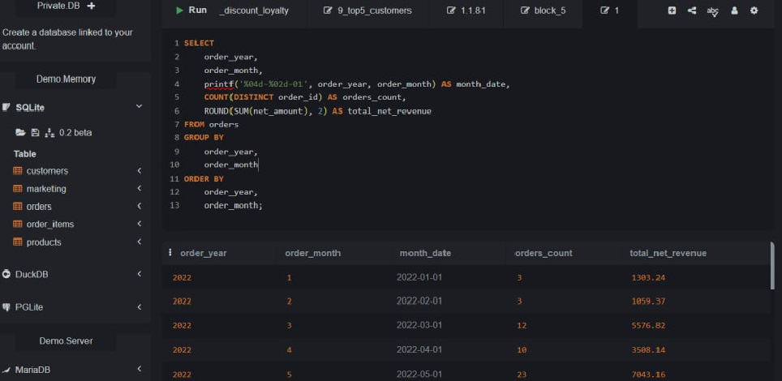
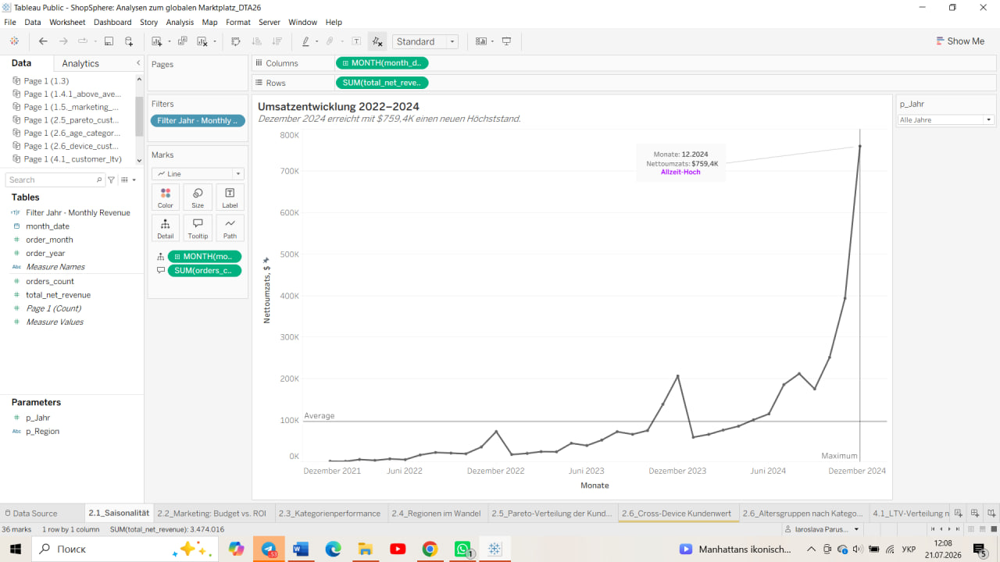
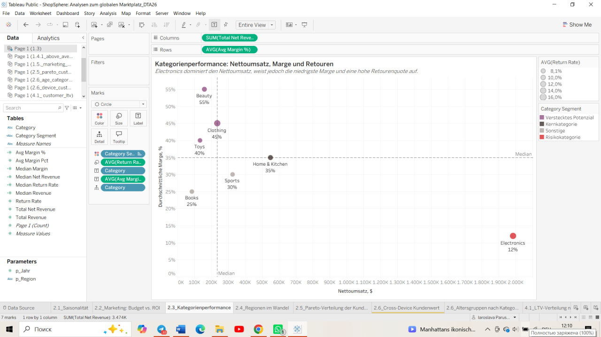
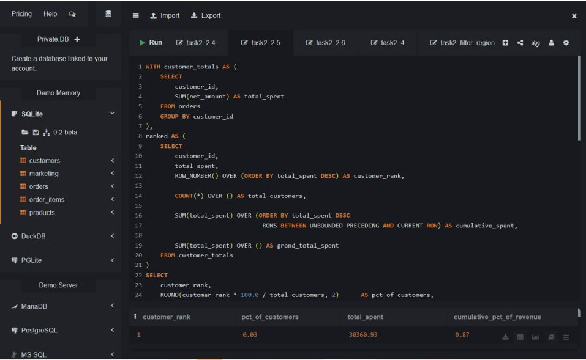

# ShopSphere — аналіз глобального маркетплейсу

## Executive Summary

ShopSphere — аналітичний проєкт глобального маркетплейсу за 2022–2024 роки.

Мета проєкту — не просто описати продажі, а відповісти на ключові управлінські питання:

- як і за рахунок чого росте бізнес;
- наскільки ефективно використовується маркетинговий бюджет;
- які канали приводять найбільш цінних клієнтів;
- які товарні категорії справді економічно привабливі;
- які регіони мають найбільший потенціал;
- наскільки виручка залежить від невеликої групи High-Value клієнтів;
- чи допомагають великі знижки формувати повторні покупки;
- чи спрацював A/B-експеримент нового checkout.

За результатами аналізу були створені три управлінські Tableau Dashboard:

1. **CEO Dashboard** — загальна картина бізнесу.
2. **Marketing & Customer LTV Dashboard** — ефективність маркетингових каналів і цінність клієнтів.
3. **A/B Test Checkout Dashboard** — статистична оцінка продуктового експерименту.

Основний принцип проєкту:

**дані → SQL-аналіз → візуалізація → інтерпретація → бізнес-рішення.**

## Business Context

CEO ShopSphere хоче зрозуміти не лише те, чи зростає компанія, а й **якість цього зростання**.

Основні бізнес-питання:

- Куди спрямовуються маркетингові гроші і чи окупаються вони?
- Хто є найціннішими клієнтами?
- Які категорії генерують якісну виручку, а які лише створюють великий оборот?
- Які регіони можуть стати наступними драйверами зростання?
- Наскільки бізнес залежить від High-Value клієнтів?
- Чи підтримують знижки довгострокову активність клієнтів?
- Чи варто масштабувати новий дизайн checkout?

Тому аналіз був побудований не навколо окремих графіків, а навколо конкретних бізнес-рішень.

## Data & Methodology

Для аналізу використовувалися п'ять основних таблиць:

### `customers`
Дані про клієнтів:
- customer_id;
- region;
- country;
- age;
- gender;
- acquisition_channel;
- signup_date.

### `orders`
Дані про замовлення:
- order_id;
- customer_id;
- order_date;
- device;
- channel;
- discount_pct;
- gross_amount;
- discount_amount;
- net_amount;
- free_shipping;
- ab_variant;
- is_returned.

### `order_items`
Деталізація товарів усередині замовлення.

### `products`
Дані про товари та категорії, включно з ціною, собівартістю та маржею.

### `marketing`
Дані маркетингових кампаній:
- channel;
- budget;
- impressions;
- clicks;
- conversions;
- attributed_revenue.


  ## Analytical Workflow

Проєкт був реалізований у декілька етапів:

### 1. SQL
SQL використовувався для:
- перевірки та підготовки даних;
- JOIN таблиць;
- агрегації;
- розрахунку KPI;
- сегментації клієнтів;
- ranking та window functions;
- Pareto-аналізу;
- підготовки датасетів для Tableau;
- підготовки вибірки A/B-експерименту.

### 2. Python / Google Colab
Python використовувався для статистичної перевірки A/B-експерименту:
- descriptive statistics;
- Welch t-test;
- 95% confidence intervals;
- p-values.

### 3. Tableau
Tableau використовувався для:
- exploratory visualizations;
- KPI;
- порівняння сегментів;
- інтерактивних фільтрів;
- створення трьох фінальних управлінських Dashboard.

### Analytical Pipeline

**Raw Data → SQL → Analytical Dataset → Python Statistics → Tableau → Business Decision**

# Аналіз 2.1. Сезонність та динаміка виручки
# Analyse 2.1. Saisonalität und Umsatzentwicklung

## Business Question
## Бізнес-питання

Wie entwickelt sich der Nettoumsatz von ShopSphere im Zeitverlauf und gibt es wiederkehrende saisonale Umsatzspitzen?
Як змінюється чиста виручка ShopSphere у часі та чи існують повторювані сезонні піки продажів?

---

## Verwendete Daten
## Використані дані

Для аналізу використовувалась таблиця `orders`.

Основні поля:

- `order_id` — унікальний номер замовлення;
- `order_year` — рік замовлення;
- `order_month` — місяць замовлення;
- `net_amount` — чиста сума замовлення після знижки.

Оскільки метою було дослідити динаміку продажів у часі, окремі замовлення були агреговані до рівня місяця.

---

## SQL-Abfrage
## SQL-запит

```sql
SELECT
    order_year,
    order_month,
    printf('%04d-%02d-01', order_year, order_month) AS month_date,
    COUNT(DISTINCT order_id) AS orders_count,
    ROUND(SUM(net_amount), 2) AS total_net_revenue
FROM orders
GROUP BY
    order_year,
    order_month
ORDER BY
    order_year,
    order_month;
```

### SQL-запит та результат у SQLiteOnline



## Was macht die SQL-Abfrage?
## Що робить SQL-запит?

Запит перетворює окремі замовлення з таблиці `orders` у місячний часовий ряд.

### 1. `order_year` та `order_month`

Визначають рік і місяць, до якого належить кожне замовлення.

### 2. `month_date`

Поле:

`printf('%04d-%02d-01', order_year, order_month)`

створює дату першого дня відповідного місяця, наприклад:

`2022-07-01`.

Це потрібно для правильної часової осі в Tableau.

### 3. `COUNT(DISTINCT order_id)`

Рахує кількість унікальних замовлень у кожному місяці.

### 4. `SUM(net_amount)`

Рахує сумарну чисту виручку після знижок за кожний місяць.

### 5. `GROUP BY`

Об'єднує всі замовлення одного року та місяця.

### 6. `ORDER BY`

Розташовує результат у хронологічному порядку.

## SQL-Ergebnis
## Результат SQL

У результаті було отримано місячний аналітичний датасет з такими показниками:

- `order_year` — рік;
- `order_month` — місяць;
- `month_date` — дата для часової осі;
- `orders_count` — кількість замовлень;
- `total_net_revenue` — чиста виручка за місяць.

Наприклад:

- січень 2022 — 3 замовлення та $1,303.24 чистої виручки;
- березень 2022 — 12 замовлень та $5,576.82;
- липень 2022 — 62 замовлення та $16,546.22.

Отриманий місячний датасет був використаний для побудови графіка динаміки та сезонності виручки в Tableau.

## Tableau-Visualisierung
## Візуалізація Tableau
На графіку:

- X-Achse — місяці;
- Y-Achse — чиста виручка;
- темна лінія — загальна динаміка виручки;
- фіолетові ділянки — періоди сезонних піків;
- підписи показують грудневі максимуми 2022, 2023 та 2024 років.

## Interpretation
## Інтерпретація

Die Analyse zeigt zwei Effekte gleichzeitig:

1. einen starken langfristigen Wachstumstrend;
2. wiederkehrende Umsatzspitzen zum Jahresende.

Аналіз показує два ефекти одночасно:

1. сильний довгостроковий тренд зростання;
2. повторювані піки виручки наприкінці року.

Особливо важливо, що листопад–грудень виділяються не лише у 2024 році. Схожий патерн спостерігається і в попередніх роках, тому це можна розглядати як ознаку сезонності.
При цьому масштаб сезонного піку швидко збільшується разом зі зростанням самого бізнесу.
Грудень 2024 року досягає приблизно $759.4K чистої виручки — нового максимуму за весь аналізований період.

## Business Recommendation
## Бізнес-рекомендація

Оскільки найбільше навантаження на бізнес припадає на кінець року, ShopSphere варто планувати сезонний пік заздалегідь.

Рекомендується:

- збільшувати товарні запаси перед листопадом–груднем;
- заздалегідь планувати маркетингові кампанії;
- контролювати логістичні потужності;
- підготувати customer support до підвищеного навантаження;
- окремо аналізувати повернення після пікових місяців;
- використовувати попередні сезонні патерни для прогнозування попиту.

Особливо важливо враховувати, що абсолютний розмір піків швидко зростає. Тому операційні потужності мають масштабуватися разом із бізнесом.

# Аналіз 2.2. Ефективність маркетингових каналів: бюджет проти ROI
# Analyse 2.2. Marketingeffizienz: Budget vs. ROI

## Business Question
## Бізнес-питання

Welche Marketingkanäle nutzen das Budget am effizientesten und wie viel Umsatz generiert jeder investierte Dollar?

Які маркетингові канали найефективніше використовують бюджет і скільки виручки приносить кожен вкладений долар?

Цей аналіз відповідає на одне з головних питань CEO:

**Куди спрямовуються маркетингові гроші та чи ефективно вони використовуються?**

---

## Verwendete Daten
## Використані дані

Для аналізу використовувалась таблиця `marketing`.

Основні поля:

- `channel` — маркетинговий канал;
- `budget` — витрати на маркетинговий канал;
- `attributed_reven` — виручка, яку маркетингова атрибуція віднесла до відповідного каналу.

У даних представлені шість каналів:

- Organic — органічний канал;
- Email — email-маркетинг;
- Influencer — інфлюенсер-маркетинг;
- Referral — реферальний канал;
- Social Ads — реклама в соціальних мережах;
- Paid Search — платна пошукова реклама.

---

## Definition des ROI
## Визначення ROI

У межах цього проєкту ROI розраховується як:

`Attributed Revenue / Marketing Budget`

Тобто показник показує, скільки доларів атрибутованої виручки припадає на кожний $1 маркетингового бюджету.

Наприклад:

`ROI = 8.02`

означає, що кожен $1 бюджету приніс приблизно $8.02 атрибутованої виручки.

Технічно цей показник ближчий до ROAS, однак у завданні та Tableau він позначений як ROI.

---

## SQL-Abfrage
## SQL-запит

```sql
SELECT
    channel,
    ROUND(SUM(budget), 2) AS total_budget,
    ROUND(SUM(attributed_reven), 2) AS total_attributed_revenue,
    ROUND(
        1.0 * SUM(attributed_reven) / SUM(budget),
        2
    ) AS roi
FROM marketing
GROUP BY channel
ORDER BY roi DESC;

```

### SQL-запит та результат у SQLiteOnline


## SQL-Ergebnis
## Результат SQL

Загальний маркетинговий бюджет становить приблизно **$981.4K**, а загальна атрибутована виручка — приблизно **$2.38M**.

Результати за каналами:

| Канал | Бюджет | Частка бюджету | Атрибутована виручка | ROI |
|---|---:|---:|---:|---:|
| Organic | $20,364 | 2.08% | $163,398 | 8.02 |
| Email | $37,468 | 3.82% | $243,610 | 6.50 |
| Influencer | $112,337 | 11.45% | $519,453 | 4.62 |
| Referral | $73,766 | 7.52% | $263,536 | 3.57 |
| Social Ads | $286,488 | 29.19% | $589,544 | 2.06 |
| Paid Search | $450,959 | 45.95% | $598,703 | 1.33 |

Найвищу віддачу показує **Organic — 8.02**, а найнижчу — **Paid Search — 1.33**.
При цьому Paid Search отримує **45.95% усього маркетингового бюджету**, тобто майже половину всіх маркетингових витрат.

## Tableau-Visualisierung
## Візуалізація Tableau


### Wie liest man die Grafik?
### Як читати графік?

**X-Achse — вісь X:**  
Gesamtbudget — загальний маркетинговий бюджет.

Чим правіше знаходиться канал, тим більше грошей компанія в нього вкладає.

**Y-Achse — вісь Y:**  
ROI — віддача на кожний вкладений долар.

Чим вище знаходиться канал, тим ефективніше він перетворює маркетинговий бюджет в атрибутовану виручку.

Кожна точка представляє один маркетинговий канал.

Розмір точки показує обсяг атрибутованої виручки.

## Interpretation
## Інтерпретація

Аналіз показує явний дисбаланс між розміром бюджету та ефективністю маркетингових каналів.

### Organic
Organic має найвищий ROI — **8.02**.
Це означає, що кожний $1 маркетингового бюджету приносить приблизно $8.02 атрибутованої виручки.
При цьому канал отримує лише **2.08% загального маркетингового бюджету**.

### Email
Email займає друге місце за ефективністю з ROI **6.50**, отримуючи лише **3.82% бюджету**.

### Influencer
Influencer демонструє ROI **4.62** і отримує **11.45% бюджету**.
Канал виглядає більш збалансованим між витратами та результатом.

### Paid Search
Paid Search отримує найбільший бюджет — **$450,959**, або **45.95% усіх маркетингових витрат**.
Водночас його ROI становить лише **1.33** — найнижче значення серед усіх каналів.
Таким чином, канал, який отримує найбільшу частину бюджету, має найнижчу віддачу на кожний вкладений долар.

Це вказує на потенційну неефективність поточного розподілу маркетингового бюджету.

## Business Recommendation
## Бізнес-рекомендація

Не рекомендується повністю відмовлятися від Paid Search лише на основі цього аналізу.
Paid Search генерує великий абсолютний обсяг атрибутованої виручки — близько **$598.7K**, тому канал може залишатися важливим джерелом масштабування.
Однак поточна структура бюджету потребує оптимізації.

Рекомендується:

- поступово скоротити частину бюджету Paid Search;
- провести контрольовані тести збільшення інвестицій в Organic, Email та Influencer;
- оцінювати не лише поточний ROI, але й marginal ROI — додаткову віддачу від кожного нового долара бюджету;
- контролювати CAC та LTV клієнтів;
- не масштабувати високий ROI автоматично, оскільки ефективність каналу може знижуватися зі збільшенням бюджету.

Тому рекомендація полягає не в різкому перерозподілі коштів, а в **поетапному тестуванні нового marketing mix — нового розподілу маркетингового бюджету**.

# Аналіз 2.3. Продуктивність категорій: чиста виручка, маржа та повернення
# Analyse 2.3. Kategorienperformance: Nettoumsatz, Marge und Retouren

## Business Question
## Бізнес-питання

Welche Produktkategorien sind wirklich attraktiv, wenn Nettoumsatz, Marge und Retouren gleichzeitig berücksichtigt werden?
Які товарні категорії є справді привабливими, якщо одночасно врахувати чисту виручку, маржу та повернення?
Додатково аналіз відповідає на питання:

**Welche Kategorie erzeugt eine „Volumenillusion“ – hohen Umsatz, aber eine schwächere wirtschaftliche Qualität?**
**Яка категорія створює «ілюзію обсягу» — велику виручку, але слабшу економічну якість?**

---

## Verwendete Daten
## Використані дані

Для аналізу використовувались таблиці:

- `order_items` — товарні позиції всередині замовлень;
- `orders` — інформація про замовлення;
- `products` — характеристики товарів.

Основні поля:

- `order_id` — номер замовлення;
- `product_id` — товар;
- `category` — категорія товару;
- `line_total` — сума товарної позиції;
- `net_amount` — чиста сума замовлення після знижок;
- `is_returned` — ознака повернення;
- `margin_pct` — маржинальність товару.

---

## SQL-Abfrage
## SQL-запит

```sql
WITH order_totals AS (
    SELECT
        order_id,
        SUM(line_total) AS order_items_total
    FROM order_items
    GROUP BY order_id
),

category_orders AS (
    SELECT DISTINCT
        oi.category,
        oi.order_id,
        o.is_returned
    FROM order_items oi
    JOIN orders o
        ON oi.order_id = o.order_id
)

SELECT
    oi.category,

    ROUND(
        SUM(oi.line_total),
        2
    ) AS total_revenue,

    ROUND(
        SUM(
            CASE
                WHEN ot.order_items_total = 0 THEN 0
                ELSE oi.line_total * o.net_amount / ot.order_items_total
            END
        ),
        2
    ) AS total_net_revenue,

    ROUND(
        AVG(p.margin_pct),
        2
    ) AS avg_margin_pct,

    ROUND(
        100.0 *
        (
            SELECT COUNT(*)
            FROM category_orders co
            WHERE co.category = oi.category
              AND co.is_returned = 1
        )
        /
        (
            SELECT COUNT(*)
            FROM category_orders co
            WHERE co.category = oi.category
        ),
        2
    ) AS return_rate_pct

FROM order_items oi

JOIN orders o
    ON oi.order_id = o.order_id

JOIN products p
    ON oi.product_id = p.product_id

JOIN order_totals ot
    ON oi.order_id = ot.order_id

GROUP BY
    oi.category

ORDER BY
    total_net_revenue DESC;
```
### SQL-запит та результат у SQLiteOnline

### Що робить SQL-запит?

Запит об'єднує дані з таблиць `order_items`, `orders` та `products`, щоб оцінити кожну товарну категорію одночасно за трьома параметрами:

1. чистою виручкою;
2. середньою маржинальністю;
3. часткою повернень.

Оскільки одне замовлення може містити товари з різних категорій, чиста сума замовлення `net_amount` пропорційно розподіляється між товарними позиціями відповідно до їхньої частки у вартості замовлення.

### Результат SQL

| Категорія | Чиста виручка | Середня маржа | Повернення |
|---|---:|---:|---:|
| Electronics | $1,986,033.63 | 12% | 15.97% |
| Home & Kitchen | $549,700.83 | 35% | 10.27% |
| Sports | $325,674.21 | 30% | 8.40% |
| Clothing | $235,044.76 | 45% | 16.00% |
| Beauty | $159,176.17 | 55% | 9.97% |
| Toys | $132,623.76 | 40% | 8.98% |
| Books | $85,762.67 | 25% | 8.13% |
---

# Tableau-блок


## Tableau-Visualisierung
## Візуалізація Tableau



**X-Achse — вісь X:**  
Nettoumsatz — чиста виручка.

Чим правіше знаходиться категорія, тим більше чистої виручки вона генерує.

**Y-Achse — вісь Y:**  
Durchschnittliche Marge — середня маржа.

Чим вище категорія, тим вищою є її маржинальність.

**Größe der Kreise — розмір кружечків:**  
Retourenquote — частка повернень.

Чим більший кружечок, тим вища частка повернутих замовлень.

## Interpretation
## Інтерпретація

### Electronics: Volumenillusion
### Electronics: ілюзія обсягу

Electronics генерує близько **$1.99M чистої виручки**, або приблизно **57.2% загальної чистої виручки**.

Водночас категорія має:

- найнижчу середню маржу — лише **12%**;
- високу частку повернень — **15.97%**.

Тому Electronics створює дуже великий оборот, але якість цієї виручки слабша, ніж може здаватися при оцінці лише за обсягом продажів.
Категорію не можна назвати збитковою без повного аналізу витрат, однак її маржинальний профіль і рівень повернень є ризиковими.

### Beauty: Verstecktes Potenzial
### Beauty: прихований потенціал

Beauty генерує лише близько **$159.2K чистої виручки**, але має найвищу маржу серед усіх категорій — **55%**.
Частка повернень становить **9.97%**, що значно нижче, ніж у Electronics та Clothing.
Таким чином Beauty виглядає як потенційний «прихований діамант» — невелика за обсягом категорія з дуже привабливою маржинальністю.

### Home & Kitchen: Kernkategorie
### Home & Kitchen: основна категорія

Home & Kitchen демонструє найбільш збалансований профіль:

- $549.7K чистої виручки;
- 35% маржі;
- 10.27% повернень.

Категорія поєднує відносно великий обсяг із помірною маржею та контрольованим рівнем повернень.

### Clothing

Clothing має високу маржу — **45%**, але також найвищу частку повернень — **16.00%**.
Це означає, що категорія має хороший економічний потенціал, однак потребує окремого аналізу причин повернень.

## Business Recommendation
## Бізнес-рекомендація

### Electronics

Необхідно не просто максимізувати оборот, а покращувати якість виручки:

- аналізувати причини повернень;
- перевірити товари з найнижчою маржею;
- оптимізувати асортимент;
- контролювати знижки;
- оцінити фактичний прибуток після логістики та витрат на повернення.

### Beauty

Рекомендується контрольоване масштабування:

- збільшити видимість категорії;
- протестувати додатковий маркетинговий бюджет;
- розширити найбільш маржинальні товарні позиції;
- використовувати cross-sell та bundles — перехресні продажі та набори;
- контролювати, чи зберігається маржа при зростанні обсягу.

### Clothing

Через високу маржу та одночасно найвищу частку повернень варто окремо дослідити причини повернень — наприклад, розміри, характеристики товарів, опис або очікування клієнтів.

Загальна рекомендація для бізнесу:
**не оцінювати категорії лише за виручкою. Для управлінських рішень необхідно одночасно враховувати обсяг, маржу та повернення.**

## 2.4. Регіональна динаміка 2022–2024

### Бізнес-питання
Які регіони є найбільшими за виручкою, які демонструють найсильніше зростання і де знаходиться потенціал для подальшого масштабування ShopSphere?

### Використані дані
Для аналізу використовувались таблиці:

- `orders` — інформація про замовлення;
- `customers` — інформація про клієнтів та їхні регіони.

Основні поля:

- `order_id` — унікальний номер замовлення;
- `customer_id` — клієнт;
- `order_year` — рік замовлення;
- `net_amount` — чиста сума замовлення;
- `region` — регіон клієнта.

Таблиці `orders` та `customers` були об'єднані за `customer_id`, щоб кожне замовлення можна було віднести до відповідного регіону.

### SQL-запит

```sql
SELECT
    c.region,
    o.order_year,
    COUNT(DISTINCT o.order_id) AS orders_count,
    ROUND(SUM(o.net_amount), 2) AS total_net_revenue
FROM orders o
JOIN customers c
    ON o.customer_id = c.customer_id
GROUP BY
    c.region,
    o.order_year
ORDER BY
    c.region,
    o.order_year;

```
### SQL-запит та результат у SQLiteOnline


### Що робить SQL-запит?

Запит агрегує продажі на рівні `регіон × рік`.
Спочатку таблиця `orders` об'єднується з таблицею `customers` через `customer_id`, щоб визначити регіон кожного замовлення.
Після цього для кожного регіону та року розраховуються:

- `orders_count` — кількість унікальних замовлень;
- `total_net_revenue` — сумарна чиста виручка.
`GROUP BY region, order_year` дозволяє отримати окремий результат для кожного регіону в кожному році.
`ORDER BY region, order_year` розташовує результати послідовно за регіоном та роком.

### Візуалізація Tableau


### Інтерпретація

Усі регіони демонструють зростання чистої виручки у 2022–2024 роках, але швидкість і масштаб зростання суттєво відрізняються.

**North America** у 2024 році є найбільшим регіоном:
- 2 632 замовлення;
- приблизно $718.7K чистої виручки.

**Southeast Asia** у 2024 році вже досягає:
- 2 029 замовлень;
- приблизно $613.9K чистої виручки.

---

## 2.5. Pareto-аналіз клієнтів: концентрація виручки

### Бізнес-питання

Наскільки виручка ShopSphere концентрується серед найбільш цінних клієнтів?

Чи підтверджується класичний принцип Парето 80/20 — тобто чи генерує невелика частина клієнтів основну частину виручки?

Окремо було проаналізовано, яку частину загальної виручки створюють **Top-5% найбільш цінних клієнтів**.

### Використані дані

Для аналізу використовувалась таблиця `orders`.

Основні поля:

- `customer_id` — унікальний ідентифікатор клієнта;
- `net_amount` — чиста сума замовлення після знижки.

Оскільки один клієнт може здійснювати декілька замовлень, спочатку всі його замовлення були агреговані на рівні клієнта.

Метою було визначити загальну суму покупок кожного клієнта, відсортувати клієнтів від найбільш цінних до найменш цінних та розрахувати накопичену частку виручки.

### SQL-запит

```sql
WITH customer_totals AS (
    SELECT
        customer_id,
        SUM(net_amount) AS total_spent
    FROM orders
    GROUP BY customer_id
),
ranked AS (
    SELECT
        customer_id,
        total_spent,
        ROW_NUMBER() OVER (
            ORDER BY total_spent DESC
        ) AS customer_rank,

        COUNT(*) OVER () AS total_customers,

        SUM(total_spent) OVER (
            ORDER BY total_spent DESC
            ROWS BETWEEN UNBOUNDED PRECEDING AND CURRENT ROW
        ) AS cumulative_spent,

        SUM(total_spent) OVER () AS grand_total_spent
    FROM customer_totals
)

SELECT
    customer_rank,

    ROUND(
        customer_rank * 100.0 / total_customers,
        2
    ) AS pct_of_customers,

    ROUND(total_spent, 2) AS total_spent,

    ROUND(
        cumulative_spent * 100.0 / grand_total_spent,
        2
    ) AS cumulative_pct_of_revenue

FROM ranked
ORDER BY customer_rank;
```

### SQL-запит та результат у SQLiteOnline



### Що робить SQL-запит?

Запит виконує Pareto-аналіз у декілька етапів.

#### 1. Розрахунок цінності кожного клієнта

У CTE `customer_totals` усі замовлення агрегуються за `customer_id`.

```sql
SUM(net_amount) AS total_spent
```

Для кожного клієнта отримуємо загальну суму чистої виручки, яку він приніс ShopSphere за весь аналізований період.

Наприклад, якщо клієнт здійснив декілька замовлень, їхні `net_amount` складаються в один показник `total_spent`.

#### 2. Ранжування клієнтів

```sql
ROW_NUMBER() OVER (
    ORDER BY total_spent DESC
)
```
Клієнти сортуються від найбільш цінного до найменш цінного.

`customer_rank = 1` отримує клієнт з найбільшою загальною сумою покупок.
Це необхідно для Pareto-аналізу, оскільки ми хочемо перевірити, яку частину виручки створюють саме найбільш цінні клієнти.

#### 3. Загальна кількість клієнтів

```sql
COUNT(*) OVER () AS total_customers
```
Розраховується загальна кількість клієнтів.

У датасеті ShopSphere — **3 000 клієнтів**.

Тому:
**5% × 3 000 = 150 клієнтів.**

Отже, Top-5% — це 150 найбільш цінних клієнтів.

#### 4. Накопичена виручка

```sql
SUM(total_spent) OVER (
    ORDER BY total_spent DESC
    ROWS BETWEEN UNBOUNDED PRECEDING AND CURRENT ROW
)
```
`cumulative_spent` послідовно накопичує виручку, починаючи з найбільш цінного клієнта.
Наприклад:

- спочатку враховується клієнт №1;
- потім клієнти №1–2;
- потім №1–3;
- і так далі до всієї клієнтської бази.
Це дозволяє визначити, скільки виручки накопичується після включення певної частки найбільш цінних клієнтів.

#### 5. Загальна виручка

```sql
SUM(total_spent) OVER () AS grand_total_spent
```
Розраховується загальна чиста виручка всіх клієнтів.
Вона використовується як база для розрахунку накопиченої частки виручки.

#### 6. Частка клієнтської бази

```sql
customer_rank * 100.0 / total_customers
```
`pct_of_customers` показує, яку частину всієї клієнтської бази ми вже включили до аналізу.

Наприклад:

- 150 із 3 000 клієнтів = 5%;
- 300 клієнтів = 10%;
- 600 клієнтів = 20%.

#### 7. Накопичена частка виручки

```sql
cumulative_spent * 100.0 / grand_total_spent
```
`cumulative_pct_of_revenue` показує, який відсоток усієї виручки створюють клієнти від найціннішого до поточної позиції рейтингу.
Саме цей показник використовується для побудови накопичувальної Pareto-кривої.

---

### Підготовка даних у Tableau

SQL повертає результат на рівні окремого клієнта.
Для того щоб зробити Pareto-графік зрозумілим для бізнесу, у Tableau клієнтська база була об'єднана у послідовні групи по **5%**:

- Top 5%;
- 5–10%;
- 10–15%;
- 15–20%;
- ...
- до 100%.

Групи формуються після сортування клієнтів від найбільш цінних до найменш цінних.
Перші 5% були додатково виділені кольором, щоб підкреслити внесок найбільш цінних клієнтів.

### Візуалізація Tableau


### Як читати графік?

**Вісь X** показує частку клієнтської бази:

- 5%;
- 10%;
- 15%;
- ...
- 100%.

Клієнти розташовані від найбільш цінних до найменш цінних.

**Стовпчики** показують виручку відповідної 5-відсоткової групи клієнтів.
Перший стовпчик спеціально виділений кольором і представляє **Top-5% клієнтів**.

**Фіолетова лінія** показує накопичену частку загальної виручки.
Тобто вона відповідає на питання:
> Яку частину всієї виручки ми вже отримали, якщо беремо X% найбільш цінних клієнтів?
> 
**Горизонтальна лінія 80%** використовується як орієнтир для перевірки класичного принципу Парето 80/20.

### Ключовий результат
У ShopSphere є **3 000 клієнтів**.

Top-5% становлять лише:
**150 клієнтів.**

Разом вони генерують приблизно:
**$1.22 млн чистої виручки**

або:

**35.1% загальної виручки ShopSphere.**
Отже, лише **1 із кожних 20 клієнтів** входить до групи, яка разом створює більше третини всієї виручки компанії.

### Інтерпретація

Pareto-аналіз показує, що виручка ShopSphere суттєво концентрується серед найбільш цінних клієнтів.
Top-5% клієнтів — лише **150 осіб із 3 000** — забезпечують **35.1% усієї чистої виручки**.
Це означає, що відносно невелика частина клієнтської бази має непропорційно великий вплив на фінансовий результат компанії.
Водночас дані **не підтверджують класичне правило 80/20**.
Тобто не можна сказати, що 20% клієнтів генерують приблизно 80% виручки. Концентрація клієнтської цінності є значною, але виручка розподілена ширше, ніж у класичному Pareto-сценарії.
Це має подвійне значення для бізнесу:

1. High-Value клієнти є критично важливими для виручки та потребують окремої retention-стратегії.
2. ShopSphere не залежить виключно від дуже вузької групи покупців, що знижує ризик надмірної концентрації.

### Бізнес-рекомендація

Top-5% клієнтів доцільно виділити в окремий **High-Value сегмент**.
Для цієї групи рекомендується:

- створити VIP- або loyalty-програму;
- використовувати персоналізовані рекомендації товарів;
- пропонувати early access до нових продуктів та спеціальних пропозицій;
- забезпечити пріоритетний customer support;
- відстежувати зниження частоти покупок як можливий сигнал churn;
- використовувати персоналізовані стимули замість масових знижок.

Водночас стратегія не повинна обмежуватися лише Top-5%.
Окремою можливістю для зростання є розвиток клієнтів наступного рівня — наприклад, групи **5–20%** — з метою перевести частину з них до High-Value сегмента.
Це дозволить одночасно:

- збільшувати LTV клієнтів;
- розширювати базу найбільш цінних покупців;
- знижувати залежність виручки від невеликої групи клієнтів.

### Головний управлінський висновок

**Top-5% клієнтів ShopSphere генерують 35.1% загальної виручки.**
Це значна концентрація, хоча класичне правило 80/20 не підтверджується.
Для бізнесу пріоритетом має бути не лише утримання поточних High-Value клієнтів, але й розвиток наступного шару клієнтської бази у майбутніх High-Value покупців.

Особливо важливо, що Southeast Asia стартував із дуже низької бази — близько $12.7K у 2022 році. Тому цей регіон демонструє найсильнішу відносну динаміку зростання.
При цьому високий темп зростання необхідно інтерпретувати обережно: частково він пояснюється низькою початковою базою.
Europe також демонструє стабільне зростання — приблизно від $100.8K у 2022 році до $545.6K у 2024 році.


