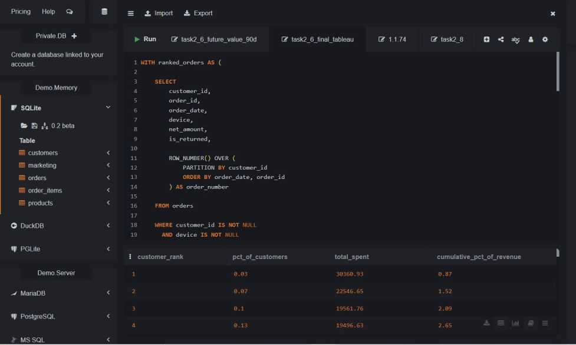

# ShopSphere — Analyse eines globalen Marktplatzes

## Executive Summary

ShopSphere ist ein Analyseprojekt eines globalen Marktplatzes für den Zeitraum 2022–2024.

Ziel ist es, nicht nur das Unternehmenswachstum zu beschreiben, sondern auch die **Qualität dieses Wachstums** zu bewerten: Marketingeffizienz, Kundenwert, Attraktivität der Produktkategorien, regionales Wachstumspotenzial und die Ergebnisse des A/B-Tests für den Checkout.

Der analytische Prozess:

**Raw Data → SQL → Analytical Dataset → Python Statistics → Tableau → Business Decision**

Es wurden drei finale Dashboards erstellt:

1. **CEO Dashboard** — Gesamtüberblick über die Unternehmensperformance.
2. **Marketing & Customer LTV Dashboard** — Marketingeffizienz und langfristiger Kundenwert.
3. **A/B Test Checkout Dashboard** — statistische Bewertung eines Produktexperiments.

---

## Daten & Methodik

Für die Analyse wurden fünf zentrale Tabellen verwendet:

| Tabelle | Inhalt |
|---|---|
| `customers` | Kunden, Regionen, Länder, Acquisition Channel, Signup Date |
| `orders` | Bestellungen, Device, Discount, Net Amount, Returns, A/B Variant |
| `order_items` | einzelne Produktpositionen innerhalb einer Bestellung |
| `products` | Produkte, Kategorien, Preis, Kosten und Marge |
| `marketing` | Channel, Budget, Impressions, Clicks, Conversions, Attributed Revenue |

### Verwendete Tools

**SQL**
- JOINs und Aggregationen;
- KPI-Berechnung;
- Kundensegmentierung;
- Window Functions;
- Pareto-Analyse;
- Vorbereitung der Datensätze für Tableau und den A/B-Test.

**Python / Google Colab**
- deskriptive Statistik;
- Welch-t-Test;
- 95%-Konfidenzintervalle;
- p-Werte.

**Tableau**
- explorative Visualisierungen;
- KPI-Darstellung;
- interaktive Filter;
- Erstellung der finalen Management-Dashboards.

---

# Block 2. Explorative Analyse

## 2.1. Saisonalität und Umsatzentwicklung

### Geschäftsfrage

Wie entwickelt sich der Nettoumsatz von ShopSphere im Zeitverlauf und gibt es wiederkehrende saisonale Umsatzspitzen?

### SQL-Abfrage

```sql
SELECT
    order_year,
    order_month,
    printf('%04d-%02d-01', order_year, order_month) AS month_date,
    COUNT(DISTINCT order_id) AS orders_count,
    ROUND(SUM(net_amount), 2) AS total_net_revenue
FROM orders
GROUP BY
    order_year,
    order_month
ORDER BY
    order_year,
    order_month;
```

### SQL-Abfrage und Ergebnis in SQLiteOnline


Die Abfrage aggregiert die Tabelle `orders` auf Monatsebene und erzeugt eine Zeitreihe für Tableau.

### Tableau-Visualisierung


### Kernergebnis

- Der Umsatz zeigt einen starken langfristigen Wachstumstrend.
- November und Dezember bilden wiederkehrende saisonale Spitzen.
- Dezember 2024 erreicht mit rund **$759.4K** den höchsten Monatsumsatz im gesamten Analysezeitraum.

### Geschäftliche Schlussfolgerung

ShopSphere sollte Lagerbestand, Logistik, Marketingkampagnen und Customer Support frühzeitig auf die erhöhte Nachfrage zum Jahresende vorbereiten.

---

## 2.2. Effizienz der Marketingkanäle: Budget vs. ROI

### Geschäftsfrage

Welche Marketingkanäle nutzen das verfügbare Budget am effizientesten?

Im Projekt wird ROI wie folgt berechnet:

`Attributed Revenue / Marketing Budget`

Der Wert zeigt, wie viel attribuierter Umsatz pro investiertem Marketing-Dollar generiert wird.

> Technisch entspricht diese Kennzahl eher dem ROAS. In der Aufgabenstellung und im Tableau-Dashboard wird jedoch die Bezeichnung ROI verwendet.

### SQL-Abfrage

```sql
SELECT
    channel,
    ROUND(SUM(budget), 2) AS total_budget,
    ROUND(SUM(attributed_reven), 2) AS total_attributed_revenue,
    ROUND(
        1.0 * SUM(attributed_reven) / SUM(budget),
        2
    ) AS roi
FROM marketing
GROUP BY channel
ORDER BY roi DESC;
```

### SQL-Abfrage und Ergebnis in SQLiteOnline


### Ergebnis

| Kanal | Budget | Budgetanteil | Attribuierter Umsatz | ROI |
|---|---:|---:|---:|---:|
| Organic | $20,364 | 2.08% | $163,398 | 8.02 |
| Email | $37,468 | 3.82% | $243,610 | 6.50 |
| Influencer | $112,337 | 11.45% | $519,453 | 4.62 |
| Referral | $73,766 | 7.52% | $263,536 | 3.57 |
| Social Ads | $286,488 | 29.19% | $589,544 | 2.06 |
| Paid Search | $450,959 | 45.95% | $598,703 | 1.33 |

### Tableau-Visualisierung


### Kernergebnis

- **Organic** erzielt mit **8.02** den höchsten ROI.
- **Email** erreicht einen ROI von **6.50**.
- **Paid Search** erhält **45.95% des gesamten Budgets**, erzielt aber mit **1.33** den niedrigsten ROI.

### Geschäftliche Schlussfolgerung

Paid Search sollte nicht abrupt reduziert oder abgeschaltet werden, da der Kanal weiterhin einen hohen absoluten Umsatz generiert.

Sinnvoller ist ein **schrittweises Testen eines neuen Marketing-Mix**, bei dem Investitionen in Organic, Email und Influencer kontrolliert erhöht und gleichzeitig marginaler ROI, CAC und LTV überwacht werden.

---

## 2.3. Kategorienperformance: Nettoumsatz, Marge und Retouren

### Geschäftsfrage

Welche Produktkategorien sind wirtschaftlich besonders attraktiv, wenn Nettoumsatz, Marge und Retouren gleichzeitig berücksichtigt werden?

### SQL-Abfrage

```sql
WITH order_totals AS (
    SELECT
        order_id,
        SUM(line_total) AS order_items_total
    FROM order_items
    GROUP BY order_id
),

category_orders AS (
    SELECT DISTINCT
        oi.category,
        oi.order_id,
        o.is_returned
    FROM order_items oi
    JOIN orders o
        ON oi.order_id = o.order_id
)

SELECT
    oi.category,

    ROUND(
        SUM(oi.line_total),
        2
    ) AS total_revenue,

    ROUND(
        SUM(
            CASE
                WHEN ot.order_items_total = 0 THEN 0
                ELSE oi.line_total * o.net_amount / ot.order_items_total
            END
        ),
        2
    ) AS total_net_revenue,

    ROUND(
        AVG(p.margin_pct),
        2
    ) AS avg_margin_pct,

    ROUND(
        100.0 *
        (
            SELECT COUNT(*)
            FROM category_orders co
            WHERE co.category = oi.category
              AND co.is_returned = 1
        )
        /
        (
            SELECT COUNT(*)
            FROM category_orders co
            WHERE co.category = oi.category
        ),
        2
    ) AS return_rate_pct

FROM order_items oi
JOIN orders o
    ON oi.order_id = o.order_id
JOIN products p
    ON oi.product_id = p.product_id
JOIN order_totals ot
    ON oi.order_id = ot.order_id

GROUP BY oi.category
ORDER BY total_net_revenue DESC;
```

### SQL-Abfrage und Ergebnis in SQLiteOnline


Da eine Bestellung Produkte aus mehreren Kategorien enthalten kann, wird `net_amount` proportional auf die einzelnen Positionen verteilt. Dadurch wird eine doppelte Zählung des Nettoumsatzes nach dem JOIN vermieden.

### Ergebnis

| Kategorie | Nettoumsatz | Durchschnittliche Marge | Retourenquote |
|---|---:|---:|---:|
| Electronics | $1,986,033.63 | 12% | 15.97% |
| Home & Kitchen | $549,700.83 | 35% | 10.27% |
| Sports | $325,674.21 | 30% | 8.40% |
| Clothing | $235,044.76 | 45% | 16.00% |
| Beauty | $159,176.17 | 55% | 9.97% |
| Toys | $132,623.76 | 40% | 8.98% |
| Books | $85,762.67 | 25% | 8.13% |

### Tableau-Visualisierung


### Kernergebnis

- **Electronics** generiert rund **$1.99M Nettoumsatz**, hat aber nur **12% Marge** und eine hohe Retourenquote von **15.97%**.
- **Beauty** erzielt rund $159K Umsatz, hat mit **55% die höchste Marge** und eine Retourenquote von 9.97%.
- **Clothing** hat eine hohe Marge von 45%, gleichzeitig aber mit 16% die höchste Retourenquote.

### Geschäftliche Schlussfolgerung

Produktkategorien sollten nicht ausschließlich anhand des Umsatzes bewertet werden.

- **Electronics:** Marge, Sortiment und Retourengründe optimieren.
- **Beauty:** kontrollierte Skalierung testen.
- **Clothing:** Ursachen der hohen Retourenquote genauer untersuchen.

---

## 2.4. Regionale Umsatzentwicklung 2022–2024

### Geschäftsfrage

Welche Regionen erzielen den höchsten Umsatz und wo besteht das größte Potenzial für weiteres Wachstum?

### SQL-Abfrage

```sql
SELECT
    c.region,
    o.order_year,
    COUNT(DISTINCT o.order_id) AS orders_count,
    ROUND(SUM(o.net_amount), 2) AS total_net_revenue
FROM orders o
JOIN customers c
    ON o.customer_id = c.customer_id
GROUP BY
    c.region,
    o.order_year
ORDER BY
    c.region,
    o.order_year;
```

### SQL-Abfrage und Ergebnis in SQLiteOnline


### Tableau-Visualisierung


### Kernergebnis

Im Jahr 2024:

- **North America** — 2,632 Bestellungen und rund $718.7K Nettoumsatz;
- **Southeast Asia** — 2,029 Bestellungen und rund $613.9K Nettoumsatz;
- **Europe** — rund $545.6K Nettoumsatz.

Southeast Asia zeigt eine besonders starke Wachstumsdynamik. Ein Teil dieses hohen relativen Wachstums ist jedoch durch die niedrige Ausgangsbasis von rund $12.7K im Jahr 2022 erklärbar.

### Geschäftliche Schlussfolgerung

**North America** ist aktuell der größte Markt.

**Southeast Asia** gehört zu den interessantesten Regionen für eine kontrollierte Skalierung.

Zusätzliche Investitionen sollten schrittweise erfolgen und anhand von ROI, LTV, absolutem Umsatz und Retourenquote bewertet werden.

---

## 2.5. Pareto-Analyse der Kunden

### Geschäftsfrage

Wie stark konzentriert sich der Umsatz auf die wertvollsten Kunden und bestätigt sich die klassische 80/20-Regel?

### SQL-Abfrage

```sql
WITH customer_totals AS (
    SELECT
        customer_id,
        SUM(net_amount) AS total_spent
    FROM orders
    GROUP BY customer_id
),

ranked AS (
    SELECT
        customer_id,
        total_spent,

        ROW_NUMBER() OVER (
            ORDER BY total_spent DESC
        ) AS customer_rank,

        COUNT(*) OVER () AS total_customers,

        SUM(total_spent) OVER (
            ORDER BY total_spent DESC
            ROWS BETWEEN UNBOUNDED PRECEDING AND CURRENT ROW
        ) AS cumulative_spent,

        SUM(total_spent) OVER () AS grand_total_spent

    FROM customer_totals
)

SELECT
    customer_rank,

    ROUND(
        customer_rank * 100.0 / total_customers,
        2
    ) AS pct_of_customers,

    ROUND(total_spent, 2) AS total_spent,

    ROUND(
        cumulative_spent * 100.0 / grand_total_spent,
        2
    ) AS cumulative_pct_of_revenue

FROM ranked
ORDER BY customer_rank;
```

### SQL-Abfrage und Ergebnis in SQLiteOnline


Die SQL-Abfrage aggregiert den Umsatz auf Kundenebene, sortiert die Kunden nach `total_spent` und berechnet den kumulierten Umsatzanteil.

In Tableau wurden die Kunden anschließend in 5%-Gruppen zusammengefasst.

### Tableau-Visualisierung


### Kernergebnis

- insgesamt **3,000 Kunden**;
- Top-5% = **150 Kunden**;
- diese Kunden generieren rund **$1.22M Umsatz**;
- das entspricht **35.1% des Gesamtumsatzes**;
- die klassische 80/20-Regel wird **nicht bestätigt**.

### Geschäftliche Schlussfolgerung

Die Top-5% sollten mit einer eigenen Retention-Strategie geschützt werden.

Gleichzeitig sollte besonders das Segment zwischen 5% und 20% entwickelt werden, um weitere Kunden in das High-Value-Segment zu überführen und das Konzentrationsrisiko zu reduzieren.

---

## 2.6. Cross-Device-Verhalten und zukünftiger Kundenwert

### Geschäftsfrage

Ist die Nutzung verschiedener Geräte während der ersten beiden Käufe ein Signal für einen höheren zukünftigen Kundenwert?

Die Kunden wurden in zwei Segmente unterteilt:

- **Same-Device** — erster und zweiter Kauf mit demselben Gerätetyp;
- **Cross-Device** — erster und zweiter Kauf mit unterschiedlichen Gerätetypen.

Um Verzerrungen durch unterschiedliche Beobachtungszeiträume zu vermeiden, wurde für alle Kunden ein identisches **90-Tage-Fenster nach dem zweiten Kauf** verwendet.

In die finale Analyse wurden nur Kunden aufgenommen, deren zweiter Kauf spätestens am `2024-10-02` stattfand.

### SQL-Abfrage

```sql
WITH ranked_orders AS (

    SELECT
        customer_id,
        order_id,
        order_date,
        device,
        net_amount,
        is_returned,

        ROW_NUMBER() OVER (
            PARTITION BY customer_id
            ORDER BY order_date, order_id
        ) AS order_number

    FROM orders

    WHERE customer_id IS NOT NULL
      AND device IS NOT NULL
      AND TRIM(device) <> ''
),

customer_journey AS (

    SELECT
        customer_id,

        MAX(
            CASE
                WHEN order_number = 1 THEN device
            END
        ) AS first_device,

        MAX(
            CASE
                WHEN order_number = 2 THEN device
            END
        ) AS second_device,

        MAX(
            CASE
                WHEN order_number = 2 THEN order_date
            END
        ) AS second_order_date

    FROM ranked_orders
    GROUP BY customer_id
    HAVING COUNT(*) >= 2
),

eligible_customers AS (

    SELECT
        customer_id,
        second_order_date,

        CASE
            WHEN first_device = second_device
                THEN 'Same-Device'
            ELSE 'Cross-Device'
        END AS journey_segment

    FROM customer_journey

    WHERE second_order_date <= '2024-10-02'
),

customer_90d AS (

    SELECT
        e.customer_id,
        e.journey_segment,

        COUNT(r.order_id) AS future_orders_90d,

        COALESCE(
            SUM(r.net_amount),
            0
        ) AS future_revenue_90d,

        COALESCE(
            SUM(r.is_returned),
            0
        ) AS returned_orders_90d,

        CASE
            WHEN COUNT(r.order_id) > 0
                THEN 1
            ELSE 0
        END AS third_purchase_within_90d

    FROM eligible_customers AS e

    LEFT JOIN ranked_orders AS r
        ON e.customer_id = r.customer_id
        AND r.order_number >= 3
        AND (
            julianday(r.order_date)
            - julianday(e.second_order_date)
        ) BETWEEN 0 AND 90

    GROUP BY
        e.customer_id,
        e.journey_segment
)

SELECT
    journey_segment,

    COUNT(*) AS eligible_customers,

    SUM(third_purchase_within_90d)
        AS customers_with_third_purchase_90d,

    ROUND(
        100.0 * SUM(third_purchase_within_90d)
        / COUNT(*),
        2
    ) AS third_purchase_rate_pct,

    ROUND(
        AVG(future_orders_90d),
        2
    ) AS avg_future_orders_90d,

    ROUND(
        AVG(future_revenue_90d),
        2
    ) AS avg_future_revenue_90d,

    ROUND(
        CASE
            WHEN SUM(future_orders_90d) > 0
            THEN
                1.0 * SUM(future_revenue_90d)
                / SUM(future_orders_90d)
        END,
        2
    ) AS avg_future_order_value_90d,

    ROUND(
        CASE
            WHEN SUM(future_orders_90d) > 0
            THEN
                100.0 * SUM(returned_orders_90d)
                / SUM(future_orders_90d)
        END,
        2
    ) AS future_return_rate_pct

FROM customer_90d

GROUP BY journey_segment

ORDER BY avg_future_revenue_90d DESC;
```

### SQL-Abfrage und Ergebnis in SQLiteOnline



### Ergebnis

| Kennzahl | Same-Device | Cross-Device |
|---|---:|---:|
| Eligible Customers | 787 | 939 |
| Third Purchase Rate | 45.11% | 45.05% |
| Avg Future Orders, 90D | 0.90 | 0.86 |
| Avg Future Revenue, 90D | $285.57 | $266.55 |
| Avg Future Order Value | $315.65 | $309.77 |
| Future Return Rate | 10.53% | 11.01% |

### Tableau-Visualisierung


### Kernergebnis

Cross-Device-Kunden zeigen **keinen offensichtlichen Vorteil**:

- Third Purchase Rate: 45.11% vs. 45.05%;
- 90-Tage-Umsatz: $285.57 bei Same-Device vs. $266.55 bei Cross-Device;
- auch die Retourenquoten sind nahezu identisch.

Für diesen Unterschied wurde kein statistischer Signifikanztest durchgeführt. Daher darf er nicht als nachgewiesener kausaler Effekt interpretiert werden.

### Geschäftliche Schlussfolgerung

Cross-Device-Verhalten ist verbreitet, sollte aber nicht allein als Merkmal für High-Value-Kunden verwendet werden.

Sinnvoller ist eine Kombination mit Recency, Frequency, Monetary Value, Acquisition Channel und LTV.

Gleichzeitig sollte ShopSphere einen möglichst nahtlosen Cross-Device Customer Experience sicherstellen.

---

# Block 3. Finale Tableau-Dashboards

Die finalen Dashboards folgen der Logik:

**Monitor → Diagnose → Decide**

**Ergebnis erkennen → Treiber verstehen → Entscheidung treffen**

| Dashboard | Zentrale Frage |
|---|---|
| CEO Dashboard | Was passiert im Unternehmen? |
| Marketing & LTV | Wo entsteht Marketing- und Kundenwert? |
| A/B Test Checkout | Welche Produktentscheidung sollte getroffen werden? |

---

## 3.1. CEO Dashboard

*Leistung des globalen Marktplatzes*


### Zentrale KPI

| KPI | Wert | Bedeutung |
|---|---:|---|
| Bestellungen | 12,274 | Umfang des Geschäfts |
| Nettoumsatz | $3.47M | finanzielles Ergebnis |
| Durchschnittlicher Bestellwert | $283 | Wert einer durchschnittlichen Bestellung |
| Retourenquote | 9.77% | Qualität der Verkäufe |

### Was sollte der CEO sofort erkennen?

1. **ShopSphere wächst stark**, gleichzeitig sind November und Dezember besonders wichtige saisonale Monate.
2. **North America** ist aktuell der größte Markt; **Southeast Asia** ist ein starker Kandidat für weiteres Wachstum.
3. **Electronics** dominiert beim Umsatz, hat aber eine niedrige Marge und hohe Retouren; **Beauty** weist die höchste Marge auf.
4. Die Top-5% der Kunden generieren **35.1% des Gesamtumsatzes**.

Die Filter **Jahr** und **Region** ermöglichen eine detaillierte Analyse einzelner Zeiträume und Märkte.

---

## 3.2. Marketing & Customer LTV Dashboard

*Marketingkanäle: ROI vs. Kunden-LTV*


Das Dashboard verbindet zwei Perspektiven:

- **kurzfristige Effizienz — ROI**;
- **langfristiger Kundenwert — Customer LTV**.

### Zentrale Signale

- **Organic — ROI Leader:** 8.02.
- **Email:** ROI 6.50.
- **Influencer & Referral — LTV Leader.**
- **Paid Search — Optimierungsbedarf:** 45.95% des Budgets, ROI 1.33 und schwacher Median-LTV.

### Customer LTV

- Influencer — AVG ~$1.99K, Median ~$1.20K;
- Referral — AVG ~$1.79K, Median ~$1.12K;
- Paid Search — AVG ~$0.65K, Median ~$0.28K.

Die Top-5%-Heatmap zeigt, **aus welchen Kombinationen von `region × acquisition channel` der größte High-Value-Umsatz stammt**.

### Geschäftliche Schlussfolgerung

Marketingeffizienz sollte nicht anhand einer einzigen Kennzahl bewertet werden.

Organic und Email sind stark beim ROI, Influencer und Referral beim langfristigen LTV. Paid Search ist der wichtigste Kandidat für eine kontrollierte Budgetoptimierung.

---

## 3.3. A/B Test Checkout Dashboard

*Ergebnis und Rollout*


### Zentrale Ergebnisse

| Segment | Differenz B − A | Lift |
|---|---:|---:|
| Gesamt | +$5.54 | +1.97% |
| Neukunden | +$39.41 | +17.64% |
| Wiederkehrende Kunden | +$4.01 | +1.38% |

Variante B zeigt in allen Segmenten einen höheren durchschnittlichen Bestellwert.

Allerdings:

- alle 95%-Konfidenzintervalle enthalten den Wert 0;
- alle p-Werte liegen über 0.05.

Damit gibt es **keinen statistisch bestätigten Vorteil von Variante B**.

### Rollout-Entscheidung

**Kein voller Rollout.**

Empfehlung: Den Test speziell bei **Neukunden** fortsetzen, da hier der größte beobachtete Uplift von **+17.64%** vorliegt, und eine größere Stichprobe sammeln.

---

## 3.4. Zentrale Management-Erkenntnisse

1. **ShopSphere wächst stark**, weist aber eine klare Saisonalität auf.
2. **North America** ist der aktuelle Marktführer; **Southeast Asia** bietet starkes Wachstumspotenzial.
3. Hoher Umsatz bedeutet nicht automatisch hohe wirtschaftliche Qualität: **Electronics** benötigt Optimierung, **Beauty** eignet sich für kontrollierte Wachstumstests.
4. Die Top-5% der Kunden generieren **35.1% des Umsatzes** und benötigen eine gezielte Retention-Strategie.
5. Der Marketing-Mix kann optimiert werden: **Paid Search** erhält das größte Budget, erzielt aber den niedrigsten ROI.
6. Variante B des Checkouts zeigt ein positives Signal, jedoch fehlen derzeit ausreichende statistische Belege für einen vollständigen Rollout.

---

## 3.5. Handlungsempfehlungen

1. Lagerbestand, Logistik und Customer Support auf die saisonalen Spitzen am Jahresende vorbereiten.
2. Die starke Position in North America sichern und die Skalierung in Southeast Asia kontrolliert testen.
3. Marge und Retouren bei Electronics optimieren und das Wachstumspotenzial von Beauty testen.
4. Eine gezielte Retention-Strategie für die Top-5% entwickeln und das Kundensegment zwischen 5% und 20% weiterentwickeln.
5. Den Marketing-Mix schrittweise optimieren und dabei marginalen ROI, CAC und LTV überwachen.
6. Variante B noch nicht vollständig ausrollen; den Test bei Neukunden fortsetzen und eine größere Stichprobe sammeln.


